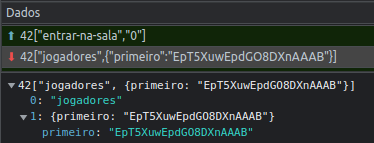
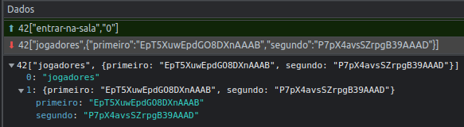
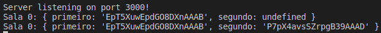
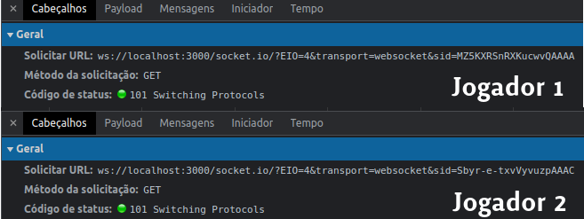
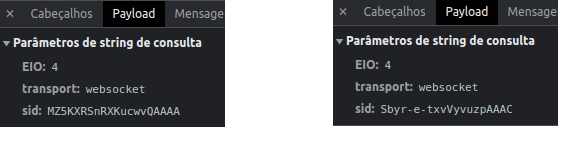
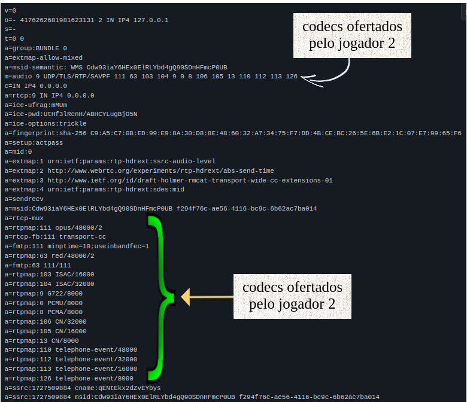
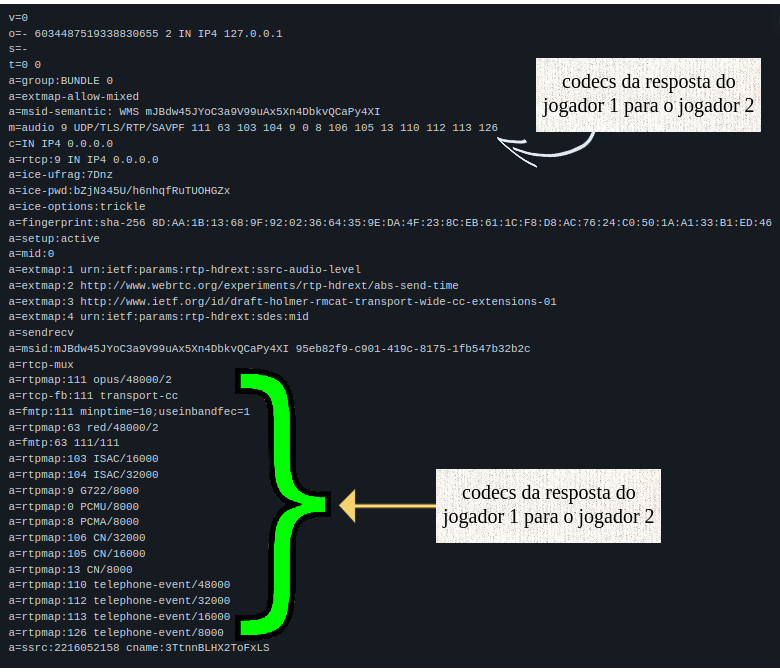
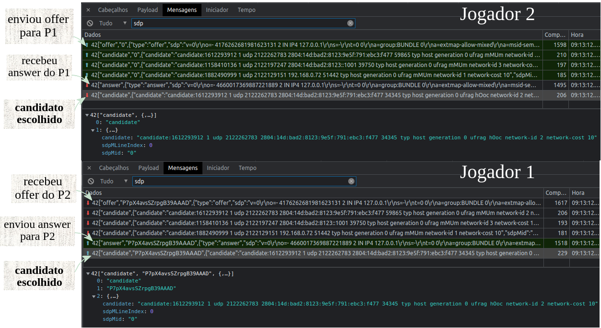
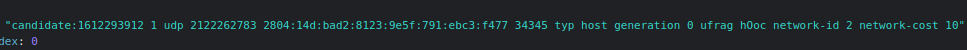
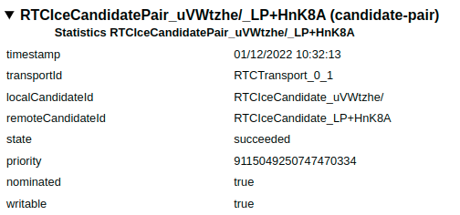

#  Relatório SMU 2022-2

### Cenário
  &nbsp;  &nbsp;  &nbsp;  &nbsp;  Para disciplina de SMU2022-2 (Sistemas Multimídia) do Curso de Engenharia de Telecomunicações,
  do Instituto Federal de Santa catarina, campus São José(IFSC-SJ),será realizado uma análise de um jogo WEB, onde a mecânica do jogo 
  acontece todo no cliente, pois o servidor fica somente responsável por receber uma lista de jogadores e passar adiante, ou seja, 
  um lado faz a oferta e outro responde(offer/answer).
  
  &nbsp;  &nbsp;  &nbsp;  &nbsp;  Toda a análise será realizada utilizando o próprio navegador, neste caso, 
  o browser será o Brave (Versão 1.44.112 Chromium). 

### Sinalização
&nbsp;  &nbsp;  &nbsp;  &nbsp;  O jogo começa quando um jogador inicia o jogo e escolhe uma sala, 
então ele envia para o servidor uma tag “entrar-na-sala” com valor “0”, logo em seguida o servidor retorna para o jogador
informando que ele é o primeiro jogador, junto com um hash que é gerado por padrão do socket.io.

  
    

  
 

Para o segundo jogador segue o mesmo sistema, porém  também vem informado que já possui um outro jogador.  

  

  
   

Na imagem abaixo é posível verificar a mesma hash que foi gerado pelo socket.io, mas agora do lado do vsCode  

  

   

O jogo utiliza o protocolo WebSocket, nas imagens abaixo mostra o cabeçalho das requisições dos jogadores, 
utilizando o método GET no protocolo socket.io ,tendo como resposta o código 101, informando que será realizada a mudança de protocolo.  

  

  
   
  
O jogador faz o registro utilizando o socket.io que gera o SID, que é um identificador único para cada jogador  

   

  
   

### Negociação de mídia
&nbsp;  &nbsp;  &nbsp;  &nbsp;  O primeiro jogador assim que entra na sala, faz a captura da mídia e fica aguardando,
assim que o segundo jogador entra na sala, faz uma lista de candidatos, em seguida faz uma oferta encapsulando o SDP completo, 
em uma mensagem com a tag “offer”, contendo todos os codecs oferecidos. Na imagem abaixo é possível verificar os codecs disponíveis 
que foram enviados na oferta, no campo "m", que é responsável pela mídia, que neste caso é áudio, podem ser vistos alguns deles rodando 
em cima de UDP/TLS/RTP/SAVPF.  

   

  
   
  
&nbsp;  &nbsp;  &nbsp;  &nbsp;  O primeiro jogador recebe a mensagem “offer” e também faz sua lista de candidatos, e responde para o segundo jogador com a mensagem com tag “answer”, contendo os codecs escolhidos para estabelecer a troca de mensagens. Logo abaixo é possível visualizar os codecs que foram escolhido para a troca de mensagens, que praticamente foram todos que a oferta do jogador 2 enviou.

   

  

### Escolha de caminho
&nbsp;  &nbsp;  &nbsp;  &nbsp;  A escolha de caminho tomada foi através de endereços tipo host no stun, utilizando UDP e IPV6, geralmente ele faz a mais simples, que foi este caso. A imagem abaixo a seguir mostra a oferta e resposta com os candidatos e o candidato escolhido

   

  
 

   

  
 

   

  
 

### Transporte de Mídia
&nbsp;  &nbsp;  &nbsp;  &nbsp;  Para o transporte de mídia é utilizado o protocolo SRTP (Secure Real-Time), este protocolo fornece confidencialidade, integridade e autenticação ao tráfego de mídia em tempo real em aplicações multimídia (áudio e vídeo), também utilizado o SRTCP (Secure Real-Time Transport Control Protocol), que é semelhante ao SRTP, porém possui dois cabeçalhos adicionais:
 - SRTCP index que é utilizado para contar a seqüência dos pacotes
 - Encrypt-flag (E) que indica se o corpo RTCP foi criptografado
