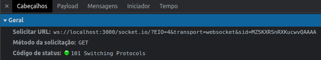
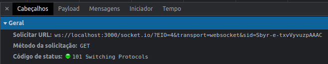
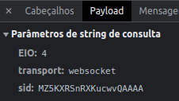

#  Relatório SMU 2022-2

### Cenário
  &nbsp;  &nbsp;  &nbsp;  &nbsp;  Para disciplina de SMU2022-2 (Sistemas Multimídia) do Curso de Engenharia de Telecomunicações,
  do Instituto Federal de Santa catarina, campus São José(IFSC-SJ),será realizado uma análise de um jogo WEB, onde a mecânica do jogo 
  acontece todo no cliente, pois o servidor fica somente responsável por receber uma lista de jogadores e passar adiante, ou seja, 
  um lado faz a oferta e outro responde(offer/answer).
  
  &nbsp;  &nbsp;  &nbsp;  &nbsp;  Toda a análise será realizada utilizando o próprio navegador, neste caso, 
  o browser será o Brave (Versão 1.44.112 Chromium). 

### Sinalização
&nbsp;  &nbsp;  &nbsp;  &nbsp;  O jogo começa quando um jogador inicia o jogo e escolhe uma sala, 
então ele envia para o servidor uma tag “entrar-na-sala” com valor “0”, logo em seguida o servidor retorna para o jogador
informando que ele é o primeiro jogador, junto com um hash que é gerado por padrão do socket.io.

  
    

 

 
Para o segundo jogador segue o mesmo sistema, porém  também vem informado que já possui um outro jogador.

  

 

 
Na imagem abaixo é posível verificar a mesma hash que foi gerado pelo socket.io, mas agora do lado do vsCode

  

 

 
O jogo utiliza o protocolo WebSocket, nas imagens abaixo mostra o cabeçalho das requisições dos jogadores, utilizando o método GET no protocolo socket.io ,
tendo como resposta o código 101, informando que será realizada a mudança de protocolo.

  
  <h6 align="center"> Requisição do jogador 1</h6>

 

 

  
  <h6 align="center"> Requisição do jogador 2</h6> 

 

O jogador faz o registro utilizando o socket.io que gera o SID, que é um identificador único para cada jogador

  

     
    <h6 align="center"> jogador 1</h6>
      
    
  

  

    
    <h6 align="center"> jogador 2</h6>
  

Centralizado | Centralizado |
:---------: | :------: |
 |  |

 , 

